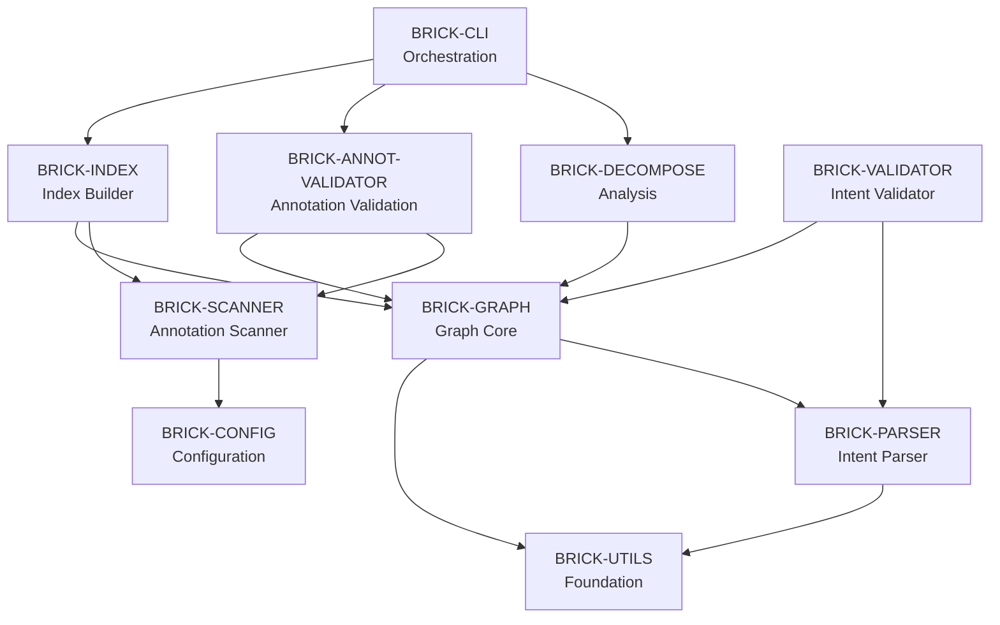

# Brick Discovery Workflow

_A Systematic Methodology for Identifying Architectural Units_

**Date:** 2025-11-24
**Status:** Methodology Definition
**Author:** Claude + Jim Meyer

---

## Purpose

This document defines a repeatable, stepwise workflow for discovering and defining **Bricks** in any codebase. Each step produces concrete artifacts that feed into subsequent steps, allowing for context clearing and iterative refinement.

**Target Project:** `~/Code/ASE` (initial application)

---

## Workflow Overview

```
┌─────────────────────────────────────────────────────────────┐
│  Step 1: Code Discovery & Structure                         │
│  Output: analysis/01-structure.yaml                          │
└────────────────┬────────────────────────────────────────────┘
                 │
┌────────────────▼────────────────────────────────────────────┐
│  Step 2: Dependency Analysis                                 │
│  Input: 01-structure.yaml                                    │
│  Output: analysis/02-dependencies.yaml                       │
└────────────────┬────────────────────────────────────────────┘
                 │
┌────────────────▼────────────────────────────────────────────┐
│  Step 3: Semantic Analysis & Clustering                      │
│  Input: 01-structure.yaml, 02-dependencies.yaml             │
│  Output: analysis/03-clusters.yaml                           │
└────────────────┬────────────────────────────────────────────┘
                 │
┌────────────────▼────────────────────────────────────────────┐
│  Step 4: Test Mapping & Boundaries                           │
│  Input: 01-structure.yaml, 03-clusters.yaml                 │
│  Output: analysis/04-tests.yaml                              │
└────────────────┬────────────────────────────────────────────┘
                 │
┌────────────────▼────────────────────────────────────────────┐
│  Step 5: Brick Synthesis                                     │
│  Input: All previous artifacts (01-04)                       │
│  Output: bricks/*.brick.yaml (one per Brick)                │
└────────────────┬────────────────────────────────────────────┘
                 │
┌────────────────▼────────────────────────────────────────────┐
│  Step 6: Metrics & Health Assessment                         │
│  Input: bricks/*.brick.yaml, 02-dependencies.yaml           │
│  Output: analysis/06-metrics.yaml                            │
└────────────────┬────────────────────────────────────────────┘
                 │
┌────────────────▼────────────────────────────────────────────┐
│  Step 7: Documentation & Visualization                       │
│  Input: All artifacts                                        │
│  Output: docs/jig-concept/AG-Bricks/AG011_*.md              │
└─────────────────────────────────────────────────────────────┘
```

**Key Properties:**
- ✅ Each step is independently executable
- ✅ Context can be cleared between steps
- ✅ Steps can be re-run with refined inputs
- ✅ Artifacts are machine-readable (YAML/JSON)
- ✅ Pipeline is deterministic and auditable

---

## Step 1: Code Discovery & Structure

### Objective
Build a comprehensive inventory of the codebase structure.

### Tasks
1. **Scan for Python files**
   - Recursively find all `.py` files
   - Exclude virtual environments, caches, build artifacts
   - Record absolute and relative paths

2. **Analyze directory structure**
   - Identify package/module hierarchy
   - Detect top-level modules vs. nested packages
   - Map `__init__.py` files to package boundaries

3. **Count lines of code**
   - Total LOC per file
   - Aggregate LOC per directory/package
   - Separate code vs. comments vs. docstrings

4. **Identify entry points**
   - Find CLI entry points (`if __name__ == "__main__"`)
   - Locate setup.py/pyproject.toml console scripts
   - Identify main application bootstrapping

### Output Artifact: `analysis/01-structure.yaml`

```yaml
metadata:
  project_name: "ASE"
  project_root: "/Users/jmeyer/Code/ASE"
  scan_date: "2025-11-24T10:30:00Z"
  total_files: 87
  total_loc: 12453

directory_tree:
  - path: "src/ase"
    type: "package"
    files: 3
    loc: 456
    children:
      - path: "src/ase/core"
        type: "package"
        files: 8
        loc: 2341
        modules:
          - name: "analyzer.py"
            loc: 342
            has_classes: true
            has_functions: true
          - name: "graph.py"
            loc: 678
            has_classes: true
            has_functions: true

packages:
  - name: "ase"
    path: "src/ase"
    subpackages: ["core", "cli", "utils"]
    total_files: 45
    total_loc: 8234

  - name: "ase.core"
    path: "src/ase/core"
    parent: "ase"
    modules: ["analyzer", "graph", "parser", "validator"]
    total_files: 8
    total_loc: 2341

modules:
  - path: "src/ase/core/analyzer.py"
    package: "ase.core"
    loc: 342
    classes: ["Analyzer", "AnalysisResult"]
    functions: ["analyze_file", "analyze_directory"]
    imports_count: 12

entry_points:
  - path: "src/ase/cli/main.py"
    type: "main_guard"
    function: "main()"

  - path: "pyproject.toml"
    type: "console_script"
    name: "ase"
    entry: "ase.cli.main:main"

test_structure:
  test_root: "tests"
  total_test_files: 42
  total_test_loc: 4219
  directories:
    - "tests/unit"
    - "tests/integration"
    - "tests/fixtures"
```

### Success Criteria
- [ ] All Python files discovered
- [ ] Directory tree accurately reflects package structure
- [ ] LOC counts are reasonable
- [ ] Entry points identified
- [ ] Test directories mapped

---

## Step 2: Dependency Analysis

### Objective
Map all import dependencies to understand coupling between modules.

### Tasks
1. **Parse imports from all Python files**
   - Extract `import X` and `from X import Y` statements
   - Distinguish standard library vs. external vs. internal
   - Record line numbers for import locations

2. **Build dependency graph**
   - Create module → module edges
   - Weight edges by import frequency
   - Identify circular dependencies

3. **Analyze external dependencies**
   - Parse requirements.txt / pyproject.toml
   - Map which modules use which external libraries
   - Identify heavy dependencies (e.g., networkx, pandas)

4. **Calculate initial coupling metrics**
   - Count imports per module
   - Identify highly coupled modules
   - Detect modules with no dependencies (foundation layer)

### Output Artifact: `analysis/02-dependencies.yaml`

```yaml
metadata:
  source_artifact: "analysis/01-structure.yaml"
  analysis_date: "2025-11-24T10:45:00Z"

import_graph:
  nodes:
    - id: "ase.core.analyzer"
      type: "internal"
      import_count: 12
      imported_by_count: 8

  edges:
    - source: "ase.core.analyzer"
      target: "ase.core.graph"
      import_type: "from_import"
      symbols: ["Graph", "Node"]
      line_number: 15

    - source: "ase.core.analyzer"
      target: "ase.utils.io"
      import_type: "import"
      symbols: ["io"]
      line_number: 8

dependency_matrix:
  # Module A → Module B: weight (number of imports)
  "ase.core.analyzer":
    "ase.core.graph": 3
    "ase.core.parser": 1
    "ase.utils.io": 2

  "ase.core.graph":
    "ase.utils.io": 1

external_dependencies:
  by_library:
    networkx:
      used_by:
        - "ase.core.graph"
        - "ase.decompose.metrics"
      import_count: 15

    click:
      used_by:
        - "ase.cli.main"
        - "ase.cli.commands"
      import_count: 8

  by_module:
    "ase.core.graph":
      - name: "networkx"
        symbols: ["Graph", "DiGraph", "algorithms"]
      - name: "json"
        symbols: ["load", "dump"]

foundation_modules:
  # Modules with no internal dependencies
  - "ase.utils.io"
  - "ase.utils.yaml_utils"
  - "ase.core.config"

highly_coupled_modules:
  # Modules with many dependencies or dependents
  - module: "ase.core.graph"
    imports: 8
    imported_by: 15
    coupling_score: 23

  - module: "ase.cli.main"
    imports: 20
    imported_by: 0
    coupling_score: 20  # orchestrator pattern

circular_dependencies:
  - cycle: ["ase.core.analyzer", "ase.core.validator", "ase.core.analyzer"]
    severity: "warning"

statistics:
  total_imports: 342
  internal_imports: 256
  external_imports: 86
  average_imports_per_module: 7.3
  max_imports_per_module: 20
```

### Success Criteria
- [ ] All imports parsed successfully
- [ ] Dependency graph is complete
- [ ] External dependencies mapped to modules
- [ ] Foundation layer identified (zero internal deps)
- [ ] Circular dependencies detected

---

## Step 3: Semantic Analysis & Clustering

### Objective
Group modules by semantic responsibility and propose initial Brick candidates.

### Tasks
1. **Analyze module purposes**
   - Extract module-level docstrings
   - Analyze function and class names
   - Identify domain concepts (e.g., "parser", "validator", "graph")
   - Use LLM to categorize module responsibilities

2. **Cluster by responsibility**
   - Group modules with related purposes
   - Apply semantic similarity
   - Consider dependency graph proximity
   - Identify cross-cutting concerns

3. **Propose initial Bricks**
   - Define candidate Bricks based on actual clustering
   - Assign modules to Bricks
   - Identify Brick boundaries
   - Name Bricks descriptively

4. **Validate layering**
   - Ensure foundation layer has no internal deps
   - Identify domain vs. application layers
   - Check for proper dependency direction (no cycles)

### Output Artifact: `analysis/03-clusters.yaml`

```yaml
metadata:
  source_artifacts:
    - "analysis/01-structure.yaml"
    - "analysis/02-dependencies.yaml"
  analysis_date: "2025-11-24T11:00:00Z"
  clustering_method: "semantic_similarity + dependency_proximity"

clusters:
  - id: "CLUSTER-01"
    name: "Foundation Utilities"
    description: "Pure utility functions with no internal dependencies"
    layer: "foundation"
    modules:
      - "ase.utils.io"
      - "ase.utils.yaml_utils"
    total_loc: 173
    external_deps: ["pathlib", "yaml"]
    internal_deps: []
    semantic_keywords: ["io", "file", "read", "write", "utility"]
    confidence: 0.95

  - id: "CLUSTER-02"
    name: "Configuration Management"
    description: "Load and manage application configuration"
    layer: "foundation"
    modules:
      - "ase.core.config"
      - "ase.core.ignore_filter"
    total_loc: 219
    external_deps: ["toml", "fnmatch"]
    internal_deps: []
    semantic_keywords: ["config", "settings", "ignore", "filter"]
    confidence: 0.92

  - id: "CLUSTER-03"
    name: "Content Parser"
    description: "Parse structured content files"
    layer: "domain"
    modules:
      - "ase.core.parser"
    total_loc: 245
    external_deps: ["frontmatter", "pyyaml"]
    internal_deps: ["ase.utils.io"]
    semantic_keywords: ["parse", "frontmatter", "markdown", "yaml"]
    confidence: 0.88

  - id: "CLUSTER-04"
    name: "Graph Core"
    description: "Graph data structures and operations"
    layer: "domain"
    modules:
      - "ase.core.graph"
      - "ase.core.relationships"
      - "ase.core.subsystem"
    total_loc: 892
    external_deps: ["networkx"]
    internal_deps: ["ase.core.parser", "ase.utils.io"]
    semantic_keywords: ["graph", "node", "edge", "traversal", "query"]
    confidence: 0.90
    note: "Large cluster - consider splitting"

  - id: "CLUSTER-05"
    name: "Validation Engine"
    description: "Validate data structures and constraints"
    layer: "domain"
    modules:
      - "ase.core.validator"
      - "ase.core.validation"
    total_loc: 528
    external_deps: ["networkx"]
    internal_deps: ["ase.core.parser", "ase.core.graph"]
    semantic_keywords: ["validate", "check", "verify", "constraint"]
    confidence: 0.87

proposed_bricks:
  - brick_id: "BRICK-UTILS"
    name: "Foundation Utilities"
    clusters: ["CLUSTER-01"]
    rationale: "Pure utilities, no internal deps, high reuse"

  - brick_id: "BRICK-CONFIG"
    name: "Configuration & Filtering"
    clusters: ["CLUSTER-02"]
    rationale: "Configuration management, foundation layer"

  - brick_id: "BRICK-PARSER"
    name: "Content Parser"
    clusters: ["CLUSTER-03"]
    rationale: "Single responsibility, clear boundary"

  - brick_id: "BRICK-GRAPH"
    name: "Graph Core"
    clusters: ["CLUSTER-04"]
    rationale: "Central domain model"
    concerns: ["May need splitting - 892 LOC"]

  - brick_id: "BRICK-VALIDATOR"
    name: "Validation Engine"
    clusters: ["CLUSTER-05"]
    rationale: "Cross-cutting validation logic"

layering:
  layers:
    - name: "foundation"
      bricks: ["BRICK-UTILS", "BRICK-CONFIG"]
      internal_deps: 0

    - name: "domain"
      bricks: ["BRICK-PARSER", "BRICK-GRAPH", "BRICK-VALIDATOR"]
      internal_deps: 3

    - name: "application"
      bricks: ["BRICK-CLI"]
      internal_deps: 12

cross_cutting_concerns:
  - concern: "Error Handling"
    modules: ["ase.utils.errors", "ase.core.exceptions"]
    note: "May warrant separate Brick or shared contract"

  - concern: "Logging"
    modules: ["ase.utils.logger"]
    note: "Foundation utility or injected dependency"

recommendations:
  - "Split BRICK-GRAPH if LOC exceeds 700"
  - "Consider separate Brick for Error Handling"
  - "Validate layering with dependency analysis"
  - "Ensure no cycles between domain Bricks"
```

### Success Criteria
- [ ] All modules assigned to clusters
- [ ] Meaningful Brick candidates identified based on actual responsibilities
- [ ] Layering is clear and acyclic
- [ ] Semantic coherence is high (confidence > 0.80)
- [ ] Large clusters flagged for potential splitting

---

## Step 4: Test Mapping & Boundaries

### Objective
Map tests to code and validate/refine Brick boundaries.

### Tasks
1. **Map test files to source files**
   - Match `test_X.py` to `X.py`
   - Identify unit tests vs. integration tests
   - Analyze test imports to understand coverage

2. **Analyze test organization**
   - Check if tests mirror source structure
   - Identify cross-Brick integration tests
   - Detect untested modules

3. **Validate Brick boundaries**
   - Check if each Brick has dedicated tests
   - Identify tests that span multiple Bricks (integration)
   - Refine Brick boundaries based on test organization

4. **Calculate test metrics**
   - Test count per Brick
   - LOC ratio (test LOC / source LOC)
   - Coverage estimates (if available)

### Output Artifact: `analysis/04-tests.yaml`

```yaml
metadata:
  source_artifacts:
    - "analysis/01-structure.yaml"
    - "analysis/03-clusters.yaml"
  analysis_date: "2025-11-24T11:15:00Z"

test_mapping:
  by_source_module:
    "ase.utils.io":
      unit_tests:
        - "tests/unit/test_io.py"
          test_count: 8
          test_loc: 142
      integration_tests: []
      coverage: "high"

    "ase.core.graph":
      unit_tests:
        - "tests/unit/test_graph.py"
          test_count: 15
          test_loc: 387
        - "tests/unit/test_graph_queries.py"
          test_count: 12
          test_loc: 289
      integration_tests:
        - "tests/integration/test_graph_loading.py"
          test_count: 5
          test_loc: 178
      coverage: "medium"

test_organization:
  structure_matches_source: true
  unit_test_dirs: ["tests/unit"]
  integration_test_dirs: ["tests/integration"]
  fixture_dirs: ["tests/fixtures"]

  total_test_files: 42
  unit_test_files: 28
  integration_test_files: 14

brick_test_boundaries:
  "BRICK-UTILS":
    unit_tests:
      - "tests/unit/test_io.py"
      - "tests/unit/test_yaml_utils.py"
    integration_tests: []
    test_count: 16
    test_loc: 287
    source_loc: 173
    test_ratio: 1.66
    boundary_quality: "excellent"
    notes: "Clear 1:1 mapping, no cross-Brick tests"

  "BRICK-GRAPH":
    unit_tests:
      - "tests/unit/test_graph.py"
      - "tests/unit/test_graph_queries.py"
      - "tests/unit/test_graph_traversal.py"
      - "tests/unit/test_relationships.py"
    integration_tests:
      - "tests/integration/test_graph_loading.py"
      - "tests/integration/test_graph_validation.py"
    test_count: 47
    test_loc: 1023
    source_loc: 892
    test_ratio: 1.15
    boundary_quality: "good"
    notes: "Integration tests cross into BRICK-PARSER and BRICK-VALIDATOR"

  "BRICK-CLI":
    unit_tests:
      - "tests/unit/cli/test_formatting.py"
      - "tests/unit/test_commands.py"
    integration_tests:
      - "tests/integration/test_init_command.py"
      - "tests/integration/test_validate_command.py"
      - "tests/integration/test_graph_commands.py"
      # ... 8 more integration tests
    test_count: 89
    test_loc: 2145
    source_loc: 2338
    test_ratio: 0.92
    boundary_quality: "fair"
    notes: "Heavy reliance on integration tests; orchestration layer expected"

cross_brick_tests:
  # Integration tests that touch multiple Bricks
  - test_file: "tests/integration/test_graph_loading.py"
    bricks_involved: ["BRICK-GRAPH", "BRICK-PARSER", "BRICK-UTILS"]
    test_count: 5
    rationale: "Tests graph loading from files (legitimate integration)"

  - test_file: "tests/integration/test_full_validation.py"
    bricks_involved: ["BRICK-VALIDATOR", "BRICK-GRAPH", "BRICK-PARSER"]
    test_count: 8
    rationale: "Tests end-to-end validation pipeline"

untested_modules:
  - module: "ase.core.experimental_feature"
    loc: 87
    reason: "No matching test file found"
    recommendation: "Add tests or mark as experimental"

boundary_refinements:
  - brick: "BRICK-GRAPH"
    current_modules: ["ase.core.graph", "ase.core.relationships", "ase.core.subsystem"]
    observation: "Subsystem module has separate test file, high cohesion"
    recommendation: "Keep together - tests validate as unit"

  - brick: "BRICK-CLI"
    current_modules: ["ase.cli.*"]
    observation: "Integration tests dominate; unit tests sparse"
    recommendation: "Acceptable for orchestration layer; consider more unit tests"

metrics_summary:
  total_tests: 320
  total_test_loc: 4219
  total_source_loc: 8234
  overall_test_ratio: 0.51

  by_brick:
    "BRICK-UTILS":
      test_ratio: 1.66
      health: "excellent"
    "BRICK-GRAPH":
      test_ratio: 1.15
      health: "good"
    "BRICK-CLI":
      test_ratio: 0.92
      health: "fair"
```

### Success Criteria
- [ ] All source files mapped to tests (or marked untested)
- [ ] Test organization patterns identified
- [ ] Each Brick has clear test boundaries
- [ ] Cross-Brick integration tests documented
- [ ] Boundary refinements recommended

---

## Step 5: Brick Synthesis

### Objective
Create formal Brick definition files based on all previous analysis.

### Tasks
1. **Synthesize Brick definitions**
   - Combine structure, dependencies, semantics, and tests
   - Define each Brick's responsibility and scope
   - Document public interfaces

2. **Define Brick contracts**
   - Specify allowed dependencies (other Bricks + external)
   - Define stability guarantees
   - Document versioning approach

3. **Map to Intent nodes** (if available)
   - Link Bricks to Outcomes and Specifications
   - Identify gaps in Intent coverage

4. **Create one `.brick.yaml` per Brick**
   - Use consistent schema
   - Include all metadata
   - Make machine-readable

### Output Artifact: `bricks/*.brick.yaml` (one per Brick)

Example: `bricks/foundation-utilities.brick.yaml`

```yaml
brick:
  id: "BRICK-UTILS"
  name: "Foundation Utilities"
  version: "1.0.0"
  layer: "foundation"
  status: "stable"

responsibility: |
  Pure utility functions for file I/O and YAML operations.
  No domain logic, no internal dependencies, maximum reusability.

scope:
  modules:
    - "ase.utils.io"
    - "ase.utils.yaml_utils"

  total_files: 2
  total_loc: 173

  entry_points: []

  excludes:
    - "ase.utils.logger"  # Cross-cutting concern

interface:
  public_api:
    classes: []

    functions:
      - signature: "read_file(path: Path) -> str"
        module: "ase.utils.io"
        stability: "stable"

      - signature: "write_file(path: Path, content: str) -> None"
        module: "ase.utils.io"
        stability: "stable"

      - signature: "ensure_dir(path: Path) -> None"
        module: "ase.utils.io"
        stability: "stable"

      - signature: "load_yaml(path: Path) -> dict[str, Any]"
        module: "ase.utils.yaml_utils"
        stability: "stable"

      - signature: "dump_yaml(data: dict[str, Any], path: Path) -> None"
        module: "ase.utils.yaml_utils"
        stability: "stable"

  internal_api:
    # Functions used within Brick but not exposed
    functions: []

  stability: "stable"
  versioning: "semver"
  breaking_changes: "require major version bump"

dependencies:
  bricks:
    allowed: []  # Foundation layer - no internal dependencies
    actual: []

  external:
    allowed:
      - name: "pathlib"
        justification: "Standard library for path operations"
      - name: "yaml"
        justification: "Standard YAML parsing"

    actual:
      - name: "pathlib"
        used_in: ["ase.utils.io"]
      - name: "yaml"
        used_in: ["ase.utils.yaml_utils"]

  violations: []

dependents:
  # Bricks that depend on this Brick
  bricks:
    - "BRICK-PARSER"
    - "BRICK-GRAPH"
    - "BRICK-INDEX"
    - "BRICK-CLI"

tests:
  unit_tests:
    - path: "tests/unit/test_io.py"
      test_count: 8
      test_loc: 142

    - path: "tests/unit/test_yaml_utils.py"
      test_count: 8
      test_loc: 145

  integration_tests: []

  total_tests: 16
  total_test_loc: 287
  test_ratio: 1.66
  coverage_estimate: "95%"

metrics:
  coupling:
    internal_edges: 0
    external_edges: 0
    coupling_ratio: "∞:1"  # No dependencies
    fan_in: 4  # depended on by 4 Bricks
    fan_out: 0

  complexity:
    average_cyclomatic: 2.3
    max_cyclomatic: 8

  cohesion:
    semantic_score: 0.95
    purpose_clarity: "excellent"

health:
  score: "excellent"
  indicators:
    - "No internal dependencies"
    - "High test coverage"
    - "Simple, focused responsibility"
    - "Stable interface"

  concerns: []

  last_review: "2025-11-24"

intent_mapping:
  # Link to Outcomes and Specifications (if using JIG)
  outcomes: []
  specifications: []
  notes: "Foundation utilities - implicit reliability requirements"

context_contract:
  # For LLM/Agent use
  essential_context:
    - "Purpose: File and YAML utilities"
    - "Layer: Foundation (no internal deps)"
    - "Stability: Stable, no breaking changes expected"

  change_constraints:
    - "MUST NOT introduce internal dependencies"
    - "MUST maintain backward compatibility"
    - "MUST NOT add domain logic"

  verification_requirements:
    - "All functions must have unit tests"
    - "Test coverage must remain > 90%"
    - "No external dependencies beyond stdlib + yaml"
```

Example: `bricks/graph-core.brick.yaml`

```yaml
brick:
  id: "BRICK-GRAPH"
  name: "Graph Core"
  version: "1.2.0"
  layer: "domain"
  status: "stable"

responsibility: |
  Central domain model for graph data structures and operations.
  Provides Graph, Node, Edge, and Subsystem abstractions.
  Supports loading, querying, and traversing graph structures.

scope:
  modules:
    - "ase.core.graph"
    - "ase.core.relationships"
    - "ase.core.subsystem"

  total_files: 3
  total_loc: 892

  concerns:
    - "Large Brick - consider future splitting"

interface:
  public_api:
    classes:
      - name: "Graph"
        module: "ase.core.graph"
        stability: "stable"
        key_methods:
          - "load_from_dir(intent_dir: Path) -> Graph"
          - "get_dependencies(node_id: str) -> list[str]"
          - "get_dependents(node_id: str) -> list[str]"
          - "find_path(start: str, end: str) -> list[str] | None"

      - name: "Edge"
        module: "ase.core.graph"
        stability: "stable"

      - name: "Subsystem"
        module: "ase.core.subsystem"
        stability: "evolving"

    functions:
      - signature: "extract_relationships(node: OSTCNode) -> list[Edge]"
        module: "ase.core.relationships"
        stability: "stable"

  stability: "stable"
  versioning: "semver"

dependencies:
  bricks:
    allowed:
      - "BRICK-PARSER"
      - "BRICK-UTILS"
    actual:
      - "BRICK-PARSER"
      - "BRICK-UTILS"

  external:
    allowed:
      - name: "networkx"
        justification: "Graph algorithms (shortest path, cycles, etc.)"
      - name: "json"
        justification: "Graph serialization"
    actual:
      - name: "networkx"
        used_in: ["ase.core.graph"]
      - name: "json"
        used_in: ["ase.core.graph"]

dependents:
  bricks:
    - "BRICK-VALIDATOR"
    - "BRICK-INDEX"
    - "BRICK-DECOMPOSE"
    - "BRICK-CLI"

tests:
  unit_tests:
    - path: "tests/unit/test_graph.py"
      test_count: 15
    - path: "tests/unit/test_graph_queries.py"
      test_count: 12
    - path: "tests/unit/test_graph_traversal.py"
      test_count: 10
    - path: "tests/unit/test_relationships.py"
      test_count: 10

  integration_tests:
    - path: "tests/integration/test_graph_loading.py"
      test_count: 5

  total_tests: 52
  test_ratio: 1.15
  coverage_estimate: "78%"

metrics:
  coupling:
    internal_edges: 2  # depends on 2 Bricks
    external_edges: 4  # depended on by 4 Bricks
    coupling_ratio: "12:1"  # internal LOC : dependency LOC
    fan_in: 4
    fan_out: 2

  complexity:
    average_cyclomatic: 5.2
    max_cyclomatic: 18  # Complex graph algorithms

health:
  score: "good"
  indicators:
    - "Central domain model"
    - "Good test coverage"
    - "Stable interface"

  concerns:
    - "Large Brick (892 LOC) - monitor for splitting"
    - "High cyclomatic complexity in some functions"

  last_review: "2025-11-24"

intent_mapping:
  outcomes:
    - "O-GRAPH-001"
  specifications:
    - "S-GRAPH-001"
    - "S-GRAPH-002"
    - "S-GRAPH-003"

context_contract:
  essential_context:
    - "Purpose: Core graph data structures and operations"
    - "Layer: Domain (depends on Parser + Utils)"
    - "Stability: Stable API, evolving internals"

  change_constraints:
    - "MUST maintain Graph public interface"
    - "MAY refactor internal graph algorithms"
    - "MUST NOT introduce dependencies beyond Parser, Utils, networkx"

  verification_requirements:
    - "Graph loading must pass integration tests"
    - "All query methods must have unit tests"
    - "Breaking changes require major version bump"
```

### Success Criteria
- [ ] One `.brick.yaml` file per identified Brick
- [ ] All Bricks follow consistent schema
- [ ] Public interfaces documented
- [ ] Dependencies specified and validated
- [ ] Metrics captured
- [ ] Intent mapping included (if applicable)

---

## Step 6: Metrics & Health Assessment

### Objective
Calculate quantitative metrics and health scores for each Brick.

### Tasks
1. **Calculate coupling metrics**
   - Coupling ratio (internal LOC : dependency LOC)
   - Fan-in (how many Bricks depend on this)
   - Fan-out (how many Bricks this depends on)
   - Afferent/Efferent coupling

2. **Calculate complexity metrics**
   - Cyclomatic complexity (average, max)
   - LOC per Brick
   - Function/class count

3. **Calculate test metrics**
   - Test ratio (test LOC / source LOC)
   - Test count
   - Coverage estimate

4. **Compute health scores**
   - Aggregate metrics into health score (0-100)
   - Identify outliers (too large, too coupled, undertested)
   - Flag issues

### Output Artifact: `analysis/06-metrics.yaml`

```yaml
metadata:
  source_artifacts:
    - "bricks/*.brick.yaml"
    - "analysis/02-dependencies.yaml"
  analysis_date: "2025-11-24T11:30:00Z"

summary:
  total_bricks: 10
  total_source_loc: 8234
  total_test_loc: 4219
  average_brick_size: 823
  largest_brick: "BRICK-CLI"
  smallest_brick: "BRICK-UTILS"

coupling_analysis:
  by_brick:
    "BRICK-UTILS":
      fan_in: 4  # depended on by 4 Bricks
      fan_out: 0  # depends on 0 Bricks
      coupling_ratio: "∞:1"
      internal_edges: 0
      external_edges: 0
      coupling_score: 100  # Perfect foundation layer

    "BRICK-GRAPH":
      fan_in: 4
      fan_out: 2
      coupling_ratio: "12:1"
      internal_edges: 2
      external_edges: 4
      coupling_score: 78  # Good domain layer

    "BRICK-CLI":
      fan_in: 0  # Top-level orchestrator
      fan_out: 8  # Depends on 8 Bricks
      coupling_ratio: "2:1"
      internal_edges: 8
      external_edges: 0
      coupling_score: 45  # Expected for orchestrator

  coupling_distribution:
    excellent: ["BRICK-UTILS", "BRICK-CONFIG"]
    good: ["BRICK-PARSER", "BRICK-GRAPH", "BRICK-SCANNER"]
    fair: ["BRICK-VALIDATOR", "BRICK-INDEX"]
    poor: ["BRICK-CLI"]  # Acceptable - orchestration layer

complexity_analysis:
  by_brick:
    "BRICK-UTILS":
      total_loc: 173
      avg_cyclomatic: 2.3
      max_cyclomatic: 8
      complexity_score: 95  # Simple

    "BRICK-GRAPH":
      total_loc: 892
      avg_cyclomatic: 5.2
      max_cyclomatic: 18
      complexity_score: 72  # Moderate

    "BRICK-VALIDATOR":
      total_loc: 528
      avg_cyclomatic: 6.8
      max_cyclomatic: 24
      complexity_score: 65  # Complex validation logic

  size_distribution:
    small: ["BRICK-UTILS", "BRICK-CONFIG", "BRICK-PARSER"]  # < 300 LOC
    medium: ["BRICK-SCANNER", "BRICK-DECOMPOSE", "BRICK-VALIDATOR"]  # 300-600 LOC
    large: ["BRICK-GRAPH", "BRICK-INDEX"]  # 600-1000 LOC
    very_large: ["BRICK-CLI"]  # > 1000 LOC

test_coverage_analysis:
  by_brick:
    "BRICK-UTILS":
      test_ratio: 1.66
      test_count: 16
      coverage_estimate: 95
      coverage_score: 100

    "BRICK-GRAPH":
      test_ratio: 1.15
      test_count: 52
      coverage_estimate: 78
      coverage_score: 80

    "BRICK-CLI":
      test_ratio: 0.92
      test_count: 89
      coverage_estimate: 70
      coverage_score: 70

  coverage_distribution:
    excellent: ["BRICK-UTILS", "BRICK-CONFIG", "BRICK-SCANNER"]  # > 90%
    good: ["BRICK-PARSER", "BRICK-GRAPH", "BRICK-VALIDATOR"]  # 75-90%
    fair: ["BRICK-INDEX", "BRICK-DECOMPOSE", "BRICK-CLI"]  # 60-75%
    poor: []

health_scores:
  by_brick:
    "BRICK-UTILS":
      coupling: 100
      complexity: 95
      coverage: 100
      size: 100  # Small, focused
      overall: 98
      grade: "A+"
      status: "excellent"

    "BRICK-GRAPH":
      coupling: 78
      complexity: 72
      coverage: 80
      size: 65  # Large Brick
      overall: 74
      grade: "B"
      status: "good"
      concerns: ["Large size", "Some complex algorithms"]

    "BRICK-CLI":
      coupling: 45  # Orchestrator - expected
      complexity: 58
      coverage: 70
      size: 40  # Very large
      overall: 53
      grade: "C"
      status: "fair"
      concerns: ["Very large", "Orchestration complexity", "Could split"]

  overall:
    average_health: 74
    median_health: 76
    excellent_count: 2
    good_count: 5
    fair_count: 3
    poor_count: 0

recommendations:
  high_priority:
    - brick: "BRICK-CLI"
      issue: "Very large (2338 LOC), high coupling"
      action: "Consider splitting into sub-Bricks by command group"

    - brick: "BRICK-GRAPH"
      issue: "Large (892 LOC), some complex algorithms"
      action: "Monitor complexity; add tests for complex paths"

  medium_priority:
    - brick: "BRICK-VALIDATOR"
      issue: "High cyclomatic complexity (max 24)"
      action: "Refactor complex validation logic"

  low_priority:
    - brick: "BRICK-INDEX"
      issue: "Moderate test coverage (75%)"
      action: "Add edge case tests"

trends:
  - "Foundation layer (UTILS, CONFIG) is healthy"
  - "Domain layer (PARSER, GRAPH, VALIDATOR) is solid"
  - "Orchestration layer (CLI) shows expected coupling"
  - "No Bricks in poor health"
  - "Overall architecture is sound"
```

### Success Criteria
- [ ] All coupling metrics calculated
- [ ] Complexity metrics per Brick
- [ ] Test coverage metrics per Brick
- [ ] Health scores assigned
- [ ] Recommendations prioritized

---

## Step 7: Documentation & Visualization

### Objective
Create comprehensive human-readable documentation with visualizations.

### Tasks
1. **Write Brick analysis document**
   - Executive summary
   - Methodology recap
   - Brick-by-Brick descriptions (similar to AG003)
   - Dependency graph (Mermaid diagram)
   - Coupling analysis
   - Test coverage analysis
   - Recommendations

2. **Generate visualizations**
   - Dependency graph (Mermaid or Graphviz)
   - Layering diagram
   - Coupling heatmap (optional)
   - Health scorecard

3. **Document gaps and next steps**
   - Missing Intent nodes (if using JIG)
   - Recommended Brick splits
   - Interface documentation needs
   - Future work

### Output Artifact: `docs/jig-concept/AG-Bricks/AG011_Brick-Analysis-ASE.md`

```markdown
# Brick Analysis: ASE System

_Identifying Architectural Units for the Alignment Graph_

**Date:** 2025-11-24
**Status:** Initial Analysis
**Author:** Claude + Jim Meyer

---

## Executive Summary

This document identifies **10 distinct Bricks** for the ASE (Alignment System Engine) project...

[Similar structure to AG003_Brick-Analysis-JIG-System.md]

---

## Methodology

Analysis followed a 7-step workflow:

1. **Code Discovery & Structure** - Built structural inventory
2. **Dependency Analysis** - Mapped import graph
3. **Semantic Clustering** - Grouped by responsibility
4. **Test Boundary Analysis** - Validated via tests
5. **Brick Synthesis** - Created formal definitions
6. **Metrics & Health** - Calculated quantitative scores
7. **Documentation** - Generated this report

Artifacts:
- `analysis/01-structure.yaml`
- `analysis/02-dependencies.yaml`
- `analysis/03-clusters.yaml`
- `analysis/04-tests.yaml`
- `bricks/*.brick.yaml` (10 files)
- `analysis/06-metrics.yaml`

---

## System Overview

[Description of ASE system based on discovery]

---

## Proposed Bricks

### Brick 1: Foundation Utilities
[Full description like in AG003]

### Brick 2: Configuration Management
[Full description]

... [All 10 Bricks] ...

---

## Brick Dependency Graph



---

## Coupling Analysis
[Tables and analysis like AG003]

---

## Test Coverage by Brick
[Tables like AG003]

---

## Recommendations
[Prioritized recommendations]

---

## Next Steps

### Immediate
1. Review Brick definitions with team
2. Address high-priority recommendations (split BRICK-CLI?)
3. Create missing Intent nodes

### Short-term
1. Implement Brick boundary enforcement
2. Add Brick metrics to CLI
3. Visualize Bricks in tooling

### Medium-term
1. Use Bricks for context scoping in LLM interactions
2. Implement Brick Context Contracts
3. Dogfood Alignment Graph on ASE itself

---

**Artifacts:**
- All analysis YAML files in `analysis/`
- All Brick definitions in `bricks/`
- This document


### Success Criteria
- [ ] Comprehensive analysis document created
- [ ] Dependency graph visualized
- [ ] All Bricks documented
- [ ] Recommendations prioritized
- [ ] Next steps defined

---

## Execution Guidelines

### Context Management
Between each step:
1. **Review artifact** - Ensure output is complete and correct
2. **Clear context** - (Optional) Start fresh conversation
3. **Load artifact** - Read previous step's output
4. **Execute step** - Run next step in workflow
5. **Validate** - Check success criteria

### Iteration
Any step can be re-run:
- Refine clustering (Step 3)
- Adjust Brick boundaries (Step 5)
- Recalculate metrics (Step 6)

### Tooling
Recommended tools:
- **Python scripts** for parsing and analysis (Steps 1-2, 4, 6)
- **LLM** for semantic clustering (Step 3)
- **Manual review** for Brick synthesis (Step 5)
- **Markdown + Mermaid** for documentation (Step 7)

### Validation Checkpoints
- After Step 2: Dependency graph makes sense
- After Step 3: Clusters are semantically coherent
- After Step 4: Test boundaries validate clusters
- After Step 5: Brick definitions are complete
- After Step 6: Metrics are reasonable
- After Step 7: Documentation is clear

---

## Customization

This workflow can be adapted:

**For smaller projects** (< 5k LOC):
- Combine Steps 1-2 (structure + dependencies)
- Skip Step 6 (metrics may not be needed)

**For larger projects** (> 50k LOC):
- Add Step 0: Identify subsystems first
- Split Step 5: Define Bricks per subsystem
- Add Step 6.5: Cross-subsystem analysis

**For non-Python projects**:
- Adapt parsing logic in Steps 1-2
- Use language-specific dependency tools
- Adjust test mapping patterns in Step 4

---

## Success Criteria (Overall)

The workflow succeeds if:
- ✅ Bricks identified match actual codebase structure and responsibilities
- ✅ Each Brick has clear, single responsibility
- ✅ Layering is acyclic (foundation → domain → application)
- ✅ Coupling ratios are reasonable (most > 5:1)
- ✅ Test boundaries align with Brick boundaries
- ✅ Documentation is comprehensive and actionable
- ✅ Artifacts enable future refinement

---

## References

- **AG003** - Brick Analysis: JIG System (methodology basis)
- **Alignment-Graph-Bricks.md** - Brick concept definition
- **ASE Project** - `~/Code/ASE` (target codebase)

---

**Next Step:** Execute Step 1 on the ASE project.
