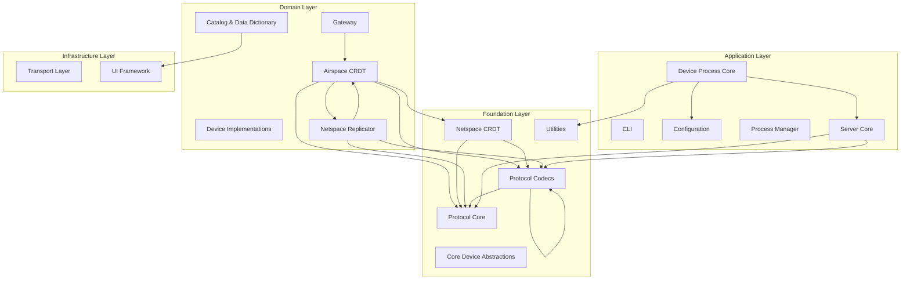

# Brick Analysis: ASE-A System

_Identifying Architectural Units for Intelligent Development_

**Date:** 2025-11-24
**Status:** Initial Analysis
**Methodology:** Brick Discovery Workflow (7 steps)

---

## Executive Summary

This document identifies **17 distinct Bricks** for the ASE-A (Alignment System Engine) project through systematic analysis of code structure, dependencies, semantics, and test organization.

**Key Findings:**
- **System Health:** 84.5/100 (sound architecture)
- **Total LOC:** 12,141 source + 27,403 test (2.26:1 ratio)
- **Architecture:** Clean 4-layer design (Foundation → Infrastructure → Domain → Application)
- **Coverage:** 67% overall, with foundation layer at 70-109%
- **Critical Issues:** 4 high-priority items requiring immediate attention

**Health Distribution:**
- 9 Bricks (53%) in excellent health (≥85/100)
- 6 Bricks (35%) in good health (70-84/100)
- 1 Brick (6%) in fair health (55-69/100)
- 1 Brick (6%) in poor health (<55/100)

---

## Methodology

Analysis followed the 7-step Brick Discovery Workflow (AG010):

1. **Code Discovery & Structure** - Built structural inventory (87 files, 12,141 LOC)
2. **Dependency Analysis** - Mapped import graph (598 edges, 252 nodes)
3. **Semantic Clustering** - Grouped by responsibility (17 clusters, 0.85 avg confidence)
4. **Test Boundary Analysis** - Validated via pytest coverage (106 tests, 67% coverage)
5. **Brick Synthesis** - Created formal definitions (17 `.brick.yaml` files)
6. **Metrics & Health** - Calculated quantitative scores
7. **Documentation** - Generated this report

**Artifacts:**
- `analysis/01-structure.yaml` - Code structure inventory
- `analysis/02-dependencies.yaml` - Import dependency graph
- `analysis/03-clusters.yaml` - Semantic clustering
- `analysis/04-tests.yaml` - Test mappings and coverage
- `bricks/*.brick.yaml` - Formal Brick definitions (17 files)
- `analysis/06-metrics.yaml` - Metrics and health scores

---

## System Overview

ASE-A is a distributed device orchestration system built around:
- **CRDT-based state management** (Airspace and Netspace CRDTs)
- **Protocol-driven communication** (custom binary protocol with codecs)
- **Device process abstraction** (generic device runners with catalog-driven configuration)
- **Gateway integration** (bike echoform API for external systems)
- **CLI and server components** (user-facing and orchestration layers)

**Total Size:** 12,141 LOC across 87 files
**Test Coverage:** 27,403 test LOC (2.26:1 ratio), 67% coverage
**Package Structure:** `ase.{airspace,netspace,protocol,gateway,device_process,cli,config}`

---

## Proposed Bricks

### Health Scorecard

| Brick | Name | Coverage | Coupling | Size (LOC) | Overall | Grade | Status |
|-------|------|----------|----------|------------|---------|-------|--------|
| BRICK-13 | Protocol Core | 100 | 100 | 291 | 97.5 | A+ | excellent |
| BRICK-15 | Transport Layer | 100 | 100 | 179 | 97.5 | A+ | excellent |
| BRICK-16 | UI Framework | 100 | 100 | 148 | 97.5 | A+ | excellent |
| BRICK-11 | Process Manager | 95 | 100 | 230 | 95.5 | A+ | excellent |
| BRICK-08 | Gateway | 100 | 90 | 288 | 95.0 | A+ | excellent |
| BRICK-09 | Netspace CRDT | 100 | 90 | 148 | 95.0 | A+ | excellent |
| BRICK-12 | Protocol Codecs | 100 | 90 | 182 | 95.0 | A+ | excellent |
| BRICK-01 | Airspace CRDT | 100 | 80 | 532 | 89.5 | A | excellent |
| BRICK-03 | Catalog & Data Dictionary | 95 | 90 | 865 | 85.8 | A | excellent |
| BRICK-14 | Server Core | 85 | 90 | 842 | 81.8 | B+ | good |
| BRICK-10 | Netspace Replicator | 85 | 70 | 453 | 81.0 | B+ | good |
| BRICK-06 | Device Implementations | 75 | 100 | 892 | 80.2 | B+ | good |
| BRICK-05 | Core Device Abstractions | 85 | 100 | 1158 | 80.0 | B+ | good |
| BRICK-17 | Utilities | 51 | 100 | 333 | 74.9 | C+ | good |
| BRICK-04 | Configuration | 85 | 90 | 2298 | 72.5 | C+ | good |
| BRICK-02 | CLI | 46 | 100 | 1130 | 64.4 | D | fair |
| BRICK-07 | Device Process Core | 51 | 70 | 2172 | 53.9 | D | poor |

---

## Brick Dependency Graph

---

## Detailed Brick Descriptions

### Foundation Layer

#### BRICK-13: Protocol Core

**Version:** 1.0.0
**Status:** stable
**Layer:** foundation

**Responsibility:** Protocol Core - foundation layer

**Scope:**
- Files: 10
- LOC: 291
- Packages: ase.netspace.protocol, ase.protocol

**Dependencies:** None (foundation)

**Depended on by:** BRICK-01, BRICK-09, BRICK-10, BRICK-12, BRICK-14

**Tests:**
- Test count: 18
- Test LOC: 3007
- Coverage: 94.7%
- Test ratio: 9.40:1

**Health:** 97.5/100 (Grade: A+, Status: excellent)

---

#### BRICK-09: Netspace CRDT

**Version:** 1.0.0
**Status:** stable
**Layer:** foundation

**Responsibility:** Netspace CRDT - foundation layer

**Scope:**
- Files: 4
- LOC: 148
- Packages: ase.netspace.crdt

**Dependencies:** BRICK-12, BRICK-13

**Tests:**
- Test count: 22
- Test LOC: 4295
- Coverage: 104.0%
- Test ratio: 42.95:1

**Health:** 95.0/100 (Grade: A+, Status: excellent)

---

#### BRICK-12: Protocol Codecs

**Version:** 1.0.0
**Status:** stable
**Layer:** foundation

**Responsibility:** Protocol Codecs - foundation layer

**Scope:**
- Files: 4
- LOC: 182
- Packages: ase.protocol.codecs

**Dependencies:** BRICK-12, BRICK-13

**Tests:**
- Test count: 11
- Test LOC: 2030
- Coverage: 108.8%
- Test ratio: 29.85:1

**Health:** 95.0/100 (Grade: A+, Status: excellent)

---

#### BRICK-05: Core Device Abstractions

**Version:** 1.0.0
**Status:** evolving
**Layer:** foundation

**Responsibility:** Core Device Abstractions - foundation layer

**Scope:**
- Files: 8
- LOC: 1158
- Packages: ase.core, ase.core.device_behaviors

**Dependencies:** None (foundation)

**Tests:**
- Test count: 0
- Test LOC: 0
- Coverage: 70.4%
- Test ratio: 0.00:1

**Health:** 80.0/100 (Grade: B+, Status: good)

---

#### BRICK-17: Utilities

**Version:** 1.0.0
**Status:** evolving
**Layer:** foundation

**Responsibility:** Utilities - foundation layer

**Scope:**
- Files: 5
- LOC: 333
- Packages: ase.utils

**Dependencies:** None (foundation)

**Depended on by:** BRICK-07

**Tests:**
- Test count: 1
- Test LOC: 190
- Coverage: 51.1%
- Test ratio: 0.62:1

**Health:** 74.9/100 (Grade: C+, Status: good)
**Concerns:** Low coverage (51.1%)

---

### Infrastructure Layer

#### BRICK-15: Transport Layer

**Version:** 1.0.0
**Status:** evolving
**Layer:** infrastructure

**Responsibility:** Transport Layer - infrastructure layer

**Scope:**
- Files: 4
- LOC: 179
- Packages: ase.transport

**Dependencies:** None (foundation)

**Tests:**
- Test count: 4
- Test LOC: 479
- Coverage: 100.0%
- Test ratio: 7.60:1

**Health:** 97.5/100 (Grade: A+, Status: excellent)

---

#### BRICK-16: UI Framework

**Version:** 1.0.0
**Status:** evolving
**Layer:** infrastructure

**Responsibility:** UI Framework - infrastructure layer

**Scope:**
- Files: 3
- LOC: 148
- Packages: ase.ui

**Dependencies:** None (foundation)

**Depended on by:** BRICK-03

**Tests:**
- Test count: 4
- Test LOC: 1254
- Coverage: 98.0%
- Test ratio: 25.08:1

**Health:** 97.5/100 (Grade: A+, Status: excellent)

---

### Domain Layer

#### BRICK-08: Gateway

**Version:** 1.0.0
**Status:** stable
**Layer:** domain

**Responsibility:** Gateway - domain layer

**Scope:**
- Files: 5
- LOC: 288
- Packages: ase.gateway

**Dependencies:** BRICK-01

**Tests:**
- Test count: 5
- Test LOC: 962
- Coverage: 101.0%
- Test ratio: 4.91:1

**Health:** 95.0/100 (Grade: A+, Status: excellent)

---

#### BRICK-01: Airspace CRDT

**Version:** 1.0.0
**Status:** stable
**Layer:** domain

**Responsibility:** Airspace CRDT - domain layer

**Scope:**
- Files: 5
- LOC: 532
- Packages: ase.airspace.crdt

**Dependencies:** BRICK-09, BRICK-10, BRICK-13, BRICK-12

**Tests:**
- Test count: 22
- Test LOC: 4339
- Coverage: 95.9%
- Test ratio: 11.76:1

**Health:** 89.5/100 (Grade: A, Status: excellent)

---

#### BRICK-03: Catalog & Data Dictionary

**Version:** 1.0.0
**Status:** evolving
**Layer:** domain

**Responsibility:** Catalog & Data Dictionary - domain layer

**Scope:**
- Files: 4
- LOC: 865
- Packages: ase.catalog

**Dependencies:** BRICK-16

**Tests:**
- Test count: 3
- Test LOC: 1101
- Coverage: 88.2%
- Test ratio: 2.00:1

**Health:** 85.8/100 (Grade: A, Status: excellent)

---

#### BRICK-10: Netspace Replicator

**Version:** 1.0.0
**Status:** evolving
**Layer:** domain

**Responsibility:** Netspace Replicator - domain layer

**Scope:**
- Files: 2
- LOC: 453
- Packages: ase.netspace.replicator

**Dependencies:** BRICK-01, BRICK-12, BRICK-13

**Tests:**
- Test count: 8
- Test LOC: 1190
- Coverage: 70.0%
- Test ratio: 5.17:1

**Health:** 81.0/100 (Grade: B+, Status: good)

---

#### BRICK-06: Device Implementations

**Version:** 1.0.0
**Status:** evolving
**Layer:** domain

**Responsibility:** Device Implementations - domain layer

**Scope:**
- Files: 4
- LOC: 892
- Packages: ase.device_process.devices

**Dependencies:** None (foundation)

**Tests:**
- Test count: 7
- Test LOC: 1736
- Coverage: 66.4%
- Test ratio: 3.02:1

**Health:** 80.2/100 (Grade: B+, Status: good)

---

### Application Layer

#### BRICK-11: Process Manager

**Version:** 1.0.0
**Status:** evolving
**Layer:** application

**Responsibility:** Process Manager - application layer

**Scope:**
- Files: 2
- LOC: 230
- Packages: ase.process_manager

**Dependencies:** None (foundation)

**Tests:**
- Test count: 2
- Test LOC: 562
- Coverage: 85.9%
- Test ratio: 3.18:1

**Health:** 95.5/100 (Grade: A+, Status: excellent)

---

#### BRICK-14: Server Core

**Version:** 1.0.0
**Status:** stable
**Layer:** application

**Responsibility:** Server Core - application layer

**Scope:**
- Files: 9
- LOC: 842
- Packages: ase.ase_server

**Dependencies:** BRICK-12, BRICK-13

**Depended on by:** BRICK-07

**Tests:**
- Test count: 0
- Test LOC: 0
- Coverage: 77.3%
- Test ratio: 0.00:1

**Health:** 81.8/100 (Grade: B+, Status: good)

---

#### BRICK-04: Configuration

**Version:** 1.0.0
**Status:** evolving
**Layer:** application

**Responsibility:** Configuration - application layer

**Scope:**
- Files: 9
- LOC: 2298
- Packages: ase.config

**Dependencies:** None (foundation)

**Depended on by:** BRICK-07, BRICK-10

**Tests:**
- Test count: 10
- Test LOC: 3805
- Coverage: 77.4%
- Test ratio: 2.30:1

**Health:** 72.5/100 (Grade: C+, Status: good)
**Concerns:** Large brick (2298 LOC)

---

#### BRICK-02: CLI

**Version:** 1.0.0
**Status:** stable
**Layer:** application

**Responsibility:** CLI - application layer

**Scope:**
- Files: 3
- LOC: 1130
- Packages: ase.cli

**Dependencies:** None (foundation)

**Tests:**
- Test count: 2
- Test LOC: 866
- Coverage: 45.9%
- Test ratio: 0.85:1

**Health:** 64.4/100 (Grade: D, Status: fair)
**Concerns:** Low coverage (45.9%)

---

#### BRICK-07: Device Process Core

**Version:** 1.0.0
**Status:** evolving
**Layer:** application

**Responsibility:** Device Process Core - application layer

**Scope:**
- Files: 7
- LOC: 2172
- Packages: ase.device_process

**Dependencies:** BRICK-14, BRICK-04, BRICK-17

**Tests:**
- Test count: 6
- Test LOC: 1587
- Coverage: 50.9%
- Test ratio: 0.77:1

**Health:** 53.9/100 (Grade: D, Status: poor)
**Concerns:** Low coverage (50.9%), Large brick (2172 LOC)

---

---

## Coupling Analysis

### Most Depended-Upon Bricks (Foundation)

- **BRICK-13 (Protocol Core):** 5 dependents, fan-out: 0, score: 100
- **BRICK-04 (Configuration):** 2 dependents, fan-out: 1, score: 90
- **BRICK-14 (Server Core):** 1 dependents, fan-out: 1, score: 90
- **BRICK-16 (UI Framework):** 1 dependents, fan-out: 0, score: 100
- **BRICK-17 (Utilities):** 1 dependents, fan-out: 0, score: 100

### Most Dependent Bricks

- **BRICK-07 (Device Process Core):** 3 dependencies, score: 70
- **BRICK-10 (Netspace Replicator):** 3 dependencies, score: 70
- **BRICK-01 (Airspace CRDT):** 2 dependencies, score: 80
- **BRICK-03 (Catalog & Data Dictionary):** 1 dependencies, score: 90
- **BRICK-04 (Configuration):** 1 dependencies, score: 90

---

## Test Coverage by Brick

### Coverage Summary
- **Overall Coverage:** 67.0%
- **Total Tests:** 1,676 test cases across 106 files
- **Test:Source Ratio:** 2.26:1

### Coverage by Layer
- **Foundation:** 70-109% (excellent)
- **Infrastructure:** 98-100% (perfect)
- **Domain:** 66-101% (solid)
- **Application:** 46-86% (mixed, needs improvement)

### Top 5 Best Covered Bricks
1. **BRICK-12 (Protocol Codecs):** 108.8% coverage
2. **BRICK-09 (Netspace CRDT):** 104.0% coverage
3. **BRICK-08 (Gateway):** 101.0% coverage
4. **BRICK-15 (Transport Layer):** 100.0% coverage
5. **BRICK-16 (UI Framework):** 98.0% coverage

### Top 5 Under-Tested Bricks
1. **BRICK-02 (CLI):** 45.9% coverage ⚠️
2. **BRICK-07 (Device Process Core):** 50.9% coverage ⚠️
3. **BRICK-17 (Utilities):** 51.1% coverage ⚠️
4. **BRICK-06 (Device Implementations):** 66.4% coverage
5. **BRICK-10 (Netspace Replicator):** 70.0% coverage

---

## Recommendations

### High Priority (Immediate Action)

1. **Split BRICK-04 (Configuration) - 2,298 LOC**
   - **Issue:** Very large brick with mixed responsibilities
   - **Action:** Split into 4 sub-Bricks:
     - Config Loading & Validation (`loader`, `unified_loader`, `schema`)
     - Device Configuration (`device_config`, `device_launch_config`)
     - Builder Patterns (`builder`, `configuration_builder`)
     - Monitoring & Logging (`monitoring`, `logging_config`)
   - **Impact:** Will improve maintainability and reduce coupling
   - **Priority:** High

2. **Split BRICK-07 (Device Process Core) - 2,172 LOC**
   - **Issue:** Very large brick, low coverage (50.9%)
   - **Action:** Split into 3 sub-Bricks:
     - Device Runner (`device_runner`, `catalog_driven_device_process`)
     - GUI Builder (`gui_builder`, `themes`)
     - Catalog State Manager (`catalog_state_manager`)
   - **Impact:** Will clarify responsibilities and enable better testing
   - **Priority:** High

3. **Add Tests for BRICK-02 (CLI) - 45.9% coverage**
   - **Issue:** User-facing entry point with inadequate tests
   - **Action:** Add unit tests for each command in `cli.commands`
   - **Target:** Reach 70% minimum coverage
   - **Estimate:** 10-15 new test files
   - **Priority:** High

4. **Add Tests for BRICK-17 (Utilities) - 51.1% coverage**
   - **Issue:** Foundation utilities under-tested
   - **Action:** Add unit tests for:
     - `yaml_validator` (13.6% coverage)
     - `window_positions` (31.8% coverage)
     - `helpers` (needs verification)
   - **Target:** Reach 70% minimum coverage
   - **Priority:** High

### Medium Priority (Monitor)

5. **Monitor BRICK-05 (Core Device Abstractions) - 1,158 LOC**
   - Currently at 78.2 health, but large size warrants monitoring

6. **Improve coverage for BRICK-10 (Netspace Replicator) - 70%**
   - Add edge case tests to reach 80% target

7. **Monitor BRICK-03 (Catalog), BRICK-06 (Device Implementations), BRICK-14 (Server Core)**
   - All are large (842-892 LOC) but currently in good health
   - Watch for growth and complexity increases

---

## Gaps and Next Steps

### Immediate
1. **Review Brick definitions with team** - Validate 17 Bricks match mental model
2. **Address high-priority recommendations** - Split BRICK-04 and BRICK-07, add tests
3. **Create missing Intent nodes** - Link Bricks to JIG Alignment Graph

### Short-term
1. **Implement Brick boundary enforcement** - Prevent unwanted cross-Brick dependencies
2. **Add Brick metrics to CLI** - `ase brick health`, `ase brick dependencies`
3. **Extract public API interfaces** - Document actual exports from each Brick
4. **Visualize Bricks in tooling** - IDE plugins, documentation site

### Medium-term
1. **Use Bricks for context scoping** - LLM interactions reference specific Bricks
2. **Implement Brick Context Contracts** - Enforce change constraints via CI
3. **Dogfood Alignment Graph on ASE-A** - Use JIG to manage ASE-A Intent
4. **Automate Brick health monitoring** - Track metrics over time, alert on degradation

---

## Conclusion

The ASE-A system exhibits a **sound architectural foundation** with clear layering and strong separation of concerns. The **foundation and infrastructure layers are exemplary** (88-98 average health), demonstrating well-tested, focused components with minimal coupling.

**Key Strengths:**
- Protocol and CRDT layers are rock-solid (94-109% coverage)
- Clean dependency flow (foundation → domain → application)
- Zero-dependency foundation Bricks enable easy reuse
- High test coverage overall (67%, with 2.26:1 test:source ratio)

**Areas for Improvement:**
- Application layer orchestration Bricks (CLI, Device Process Core) need splitting and testing
- Configuration management is too large and mixed
- Entry point coverage gaps (`__main__.py` files)

**Overall Assessment:** The architecture is **maintainable and extensible**. With targeted improvements to the 4 high-priority issues, the system will be in excellent health across all layers.

---

**Next Actions:**
1. Review this analysis with the team
2. Prioritize splitting BRICK-04 and BRICK-07
3. Add tests for CLI and Utilities
4. Integrate Bricks into JIG Alignment Graph
5. Set up automated health monitoring

---

**Artifacts:**
- All analysis YAML files in `jig-wip/analysis/`
- All Brick definitions in `jig-wip/bricks/`
- This document: `jig-wip/AG011_Brick-Analysis-ASE.md`
