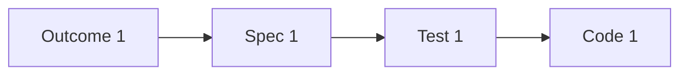

# JIG Visualization Tool - Implementation Options Analysis

This document compares different implementation approaches for the JIG visualization tool.

## Option Comparison Matrix

| Aspect | Option A: D3.js + Vanilla JS | Option B: Cytoscape.js | Option C: Mermaid.js | Option D: React + React Flow |
|--------|------------------------------|------------------------|----------------------|------------------------------|
| **Bundle Size** | ~250KB (D3.js) | ~500KB | ~100KB | ~800KB (React + deps) |
| **Build Step** | None | None | None | Required (webpack/vite) |
| **Learning Curve** | Medium | Medium | Low | High |
| **Customization** | High | High | Low | High |
| **Column Layout** | Custom (easy) | Custom (medium) | Limited | Custom (easy) |
| **Interactivity** | Excellent | Excellent | Limited | Excellent |
| **Performance** | Excellent | Good | Good | Good |
| **Maintenance** | Low | Low | Low | Medium |
| **Community** | Large | Large | Large | Large |
| **Documentation** | Excellent | Good | Good | Excellent |
| **Mobile Support** | Good | Good | Good | Good |
| **Offline** | Yes | Yes | Yes | Yes (after build) |
| **File Access** | Embed | Embed | Embed | Embed |
| **Recommendation** | ✅ **SELECTED** | ❌ Overkill | ❌ Too limited | ❌ Too complex |

## Detailed Analysis

### Option A: D3.js + Vanilla JavaScript ✅ SELECTED

**Description:** Use D3.js for data visualization with vanilla JavaScript for logic.

**Pros:**
- ✅ Industry standard for data visualization
- ✅ Excellent zoom/pan support built-in
- ✅ SVG rendering for crisp visuals
- ✅ No build step required
- ✅ Highly customizable
- ✅ Great documentation and examples
- ✅ Column constraints easy to implement
- ✅ Force-directed layout with constraints
- ✅ Large community and ecosystem

**Cons:**
- ⚠️ Steeper learning curve than simple libraries
- ⚠️ More code to write than frameworks
- ⚠️ Need to manage state manually

**Best For:**
- Custom layouts (like our column-based design)
- Interactive visualizations
- Data-driven graphics
- Projects without build tools

**Code Sample:**
```javascript
// Column-constrained force layout
const simulation = d3.forceSimulation(nodes)
  .force('x', d3.forceX(d => getColumnX(d.type)).strength(1))
  .force('y', d3.forceY(height / 2).strength(0.1))
  .force('collision', d3.forceCollide().radius(40))
  .force('link', d3.forceLink(edges).id(d => d.id));
```

**Decision:** ✅ **Selected** - Best fit for our requirements

---

### Option B: Cytoscape.js

**Description:** Specialized graph theory library with many layout algorithms.

**Pros:**
- ✅ Purpose-built for graphs
- ✅ Many layout algorithms included
- ✅ Good performance
- ✅ Rich API
- ✅ No build step

**Cons:**
- ❌ Larger bundle size
- ❌ More complex than needed
- ❌ Column constraints require custom layout
- ❌ Less flexible than D3.js for custom designs
- ❌ Overkill for our use case

**Best For:**
- Complex network analysis
- Graph algorithms (shortest path, etc.)
- Scientific visualizations
- When you need pre-built layouts

**Code Sample:**
```javascript
const cy = cytoscape({
  container: document.getElementById('cy'),
  elements: { nodes, edges },
  layout: { name: 'preset' }, // Would need custom layout
  style: [ /* ... */ ]
});
```

**Decision:** ❌ **Rejected** - Too complex for our needs

---

### Option C: Mermaid.js

**Description:** Markdown-like syntax for generating diagrams.

**Pros:**
- ✅ Very simple syntax
- ✅ Small bundle size
- ✅ Easy to learn
- ✅ Good for documentation
- ✅ No build step

**Cons:**
- ❌ Limited interactivity
- ❌ Can't enforce column layout
- ❌ Less control over positioning
- ❌ Not designed for data-driven graphs
- ❌ Limited customization

**Best For:**
- Static diagrams in documentation
- Simple flowcharts
- Sequence diagrams
- When you want markdown-like syntax

**Code Sample:**


**Decision:** ❌ **Rejected** - Too limited for our requirements

---

### Option D: React + React Flow

**Description:** Modern React-based flow/graph library.

**Pros:**
- ✅ Modern framework
- ✅ Component-based
- ✅ Great for complex UIs
- ✅ Good documentation
- ✅ Active development

**Cons:**
- ❌ Requires build step (webpack/vite)
- ❌ Larger bundle size
- ❌ More complex setup
- ❌ Overkill for single-file tool
- ❌ Harder to maintain
- ❌ Not self-contained

**Best For:**
- Large applications
- When you already use React
- Complex interactive UIs
- When you need component reusability

**Code Sample:**
```jsx
<ReactFlow
  nodes={nodes}
  edges={edges}
  onNodeClick={handleNodeClick}
  fitView
>
  <Controls />
  <Background />
</ReactFlow>
```

**Decision:** ❌ **Rejected** - Too much complexity for a simple tool

---

## Layout Algorithm Comparison

### Force-Directed (D3.js) ✅ SELECTED

**How it works:**
- Nodes repel each other
- Edges pull connected nodes together
- Constraints keep nodes in columns

**Pros:**
- ✅ Natural-looking layout
- ✅ Handles varying graph structures
- ✅ Easy to add constraints
- ✅ Animated transitions

**Cons:**
- ⚠️ Non-deterministic (different each time)
- ⚠️ Can be slow for large graphs

**Best for:** Interactive visualizations with constraints

---

### Hierarchical (Dagre)

**How it works:**
- Assigns layers to nodes
- Minimizes edge crossings
- Top-to-bottom or left-to-right

**Pros:**
- ✅ Deterministic layout
- ✅ Good for DAGs
- ✅ Minimal edge crossings

**Cons:**
- ❌ Less flexible
- ❌ Harder to customize
- ❌ Requires separate library

**Best for:** Strict hierarchies, flowcharts

---

### Grid-Based

**How it works:**
- Assign nodes to grid cells
- Fixed positions

**Pros:**
- ✅ Very simple
- ✅ Deterministic
- ✅ Fast

**Cons:**
- ❌ Rigid layout
- ❌ Wasted space
- ❌ Doesn't adapt to graph structure

**Best for:** Small, regular graphs

---

## Data Loading Strategy Comparison

### Embedded JSON ✅ SELECTED

**How it works:**
```html
<script id="graph-data" type="application/json">
{ "nodes": [...], "edges": [...] }
</script>
```

**Pros:**
- ✅ Self-contained
- ✅ No network requests
- ✅ Works offline
- ✅ Fast loading
- ✅ Portable

**Cons:**
- ⚠️ Larger file size
- ⚠️ Must regenerate to update

**Best for:** Static visualizations, portability

---

### Dynamic Fetch

**How it works:**
```javascript
fetch('graph-index.yaml')
  .then(response => response.text())
  .then(yaml => jsyaml.load(yaml))
```

**Pros:**
- ✅ Smaller HTML file
- ✅ Can update without regenerating
- ✅ Separation of data and code

**Cons:**
- ❌ Requires web server
- ❌ Network request
- ❌ CORS issues
- ❌ Doesn't work offline

**Best for:** Development, live updates

---

### Hybrid Approach

**How it works:**
- Embed data in HTML for production
- Support dynamic loading for development

**Pros:**
- ✅ Best of both worlds
- ✅ Flexible

**Cons:**
- ⚠️ More complex code

**Best for:** Production tools with dev mode

---

## File Content Display Comparison

### Embedded Content ✅ SELECTED

**How it works:**
- Include all node file contents in JSON
- Display directly from memory

**Pros:**
- ✅ Instant display
- ✅ Works offline
- ✅ No file access issues
- ✅ Self-contained

**Cons:**
- ⚠️ Larger file size (~100KB)
- ⚠️ Must regenerate when files change

**Best for:** Portability, offline use

---

### File Protocol Links

**How it works:**
- Link to `file:///path/to/file.md`
- Opens in external viewer

**Pros:**
- ✅ No embedding needed
- ✅ Always up-to-date
- ✅ Smaller HTML file

**Cons:**
- ❌ Opens external app
- ❌ Requires absolute paths
- ❌ Not portable
- ❌ Security restrictions

**Best for:** Development, local use

---

### HTTP Fetch

**How it works:**
- Fetch file content via HTTP
- Display in panel

**Pros:**
- ✅ Always up-to-date
- ✅ Smaller HTML file
- ✅ Can add features (search, etc.)

**Cons:**
- ❌ Requires web server
- ❌ Network request
- ❌ Doesn't work offline

**Best for:** Development server, live updates

---

## Rendering Strategy Comparison

### SVG (D3.js) ✅ SELECTED

**Pros:**
- ✅ Crisp at any zoom level
- ✅ Easy to style with CSS
- ✅ DOM access for events
- ✅ Good for <500 nodes

**Cons:**
- ⚠️ Slower for large graphs
- ⚠️ Memory intensive

**Best for:** Small-medium graphs, interactivity

---

### Canvas

**Pros:**
- ✅ Fast rendering
- ✅ Good for large graphs
- ✅ Low memory

**Cons:**
- ❌ Pixelated when zoomed
- ❌ No DOM access
- ❌ More complex event handling

**Best for:** Large graphs (>500 nodes)

---

### WebGL

**Pros:**
- ✅ Very fast
- ✅ Can handle thousands of nodes
- ✅ GPU accelerated

**Cons:**
- ❌ Complex to implement
- ❌ Overkill for our needs
- ❌ Compatibility issues

**Best for:** Massive graphs (>1000 nodes)

---

## Recommendation Summary

| Aspect | Recommended Approach | Rationale |
|--------|---------------------|-----------|
| **Library** | D3.js + Vanilla JS | Best balance of power and simplicity |
| **Layout** | Force-directed with constraints | Natural look, flexible, customizable |
| **Data Loading** | Embedded JSON | Self-contained, portable, fast |
| **File Content** | Embedded in JSON | Instant display, offline support |
| **Rendering** | SVG | Crisp, interactive, sufficient performance |
| **Build Process** | None (direct HTML) | Simple, no tooling required |

---

## Implementation Roadmap

### Phase 1: MVP (4-6 hours)
- Use D3.js with SVG rendering
- Force-directed layout with column constraints
- Embedded JSON data
- Basic zoom/pan

### Phase 2: Interactivity (3-4 hours)
- Node click handler
- Detail panel
- Embedded content display
- Highlight connections

### Phase 3: Generation (2-3 hours)
- Python script
- Read graph-index.yaml
- Read node files
- Generate HTML

### Phase 4: Polish (4-6 hours)
- Improve styling
- Add keyboard shortcuts
- Optimize performance
- Write documentation

**Total:** 13-19 hours

---

## Conclusion

After evaluating multiple options, **D3.js + Vanilla JavaScript** is the clear winner for our use case:

1. ✅ No build step required
2. ✅ Highly customizable for column layout
3. ✅ Excellent interactivity support
4. ✅ Self-contained single HTML file
5. ✅ Good performance for expected scale
6. ✅ Large community and resources
7. ✅ Proven technology

The embedded JSON approach ensures portability and offline functionality, while the force-directed layout with column constraints provides the exact visual structure we need.

**Next Step:** Begin Phase 1 implementation with D3.js.

---

**Last Updated:** 2025-11-21

