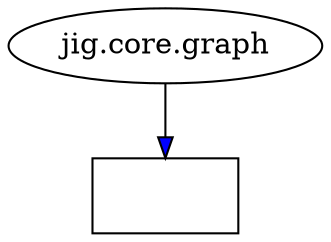

# S031: Dependency Analysis with pydeps

**Date:** 2025-11-22
**Status:** Analysis Complete
**Tool:** pydeps 3.0.1

## Overview

This document describes the use of `pydeps` to analyze the dependency structure of the jig project. pydeps is a Python dependency visualization and analysis tool that provides insights into module relationships, import structures, and potential architectural issues.

## Installation

```bash
# Install pydeps via pip
pip install pydeps

# Verify installation
pydeps --version
# Output: pydeps 3.0.1
```

pydeps automatically installs its dependency `stdlib_list` which helps it distinguish between standard library and third-party modules.

## Basic Usage

### 1. Complete Dependency Analysis (JSON Output)

```bash
pydeps src/jig --show-deps --no-output
```

**What it does:**
- Analyzes all Python modules in `src/jig`
- Outputs dependency information in JSON format
- `--no-output` prevents generating visualization files
- Shows "bacon number" (distance from entry point)
- Lists what each module imports and what imports it

**Key findings from jig:**
- 27 internal modules detected
- 6 external dependencies: click, frontmatter, networkx, toml, yaml, collections
- No circular dependencies detected
- Clear module hierarchy with bacon numbers 0-2

### 2. Check for Circular Dependencies

```bash
pydeps src/jig --show-cycles --no-output
```

**What it does:**
- Specifically looks for import cycles
- Returns empty output if no cycles found
- Helpful for identifying architectural issues

**Result for jig:**
- No circular dependencies detected (clean architecture)

### 3. List External Dependencies

```bash
pydeps src/jig --externals --no-output
```

**What it does:**
- Extracts list of direct external (non-stdlib) dependencies
- Useful for requirements.txt generation
- Excludes Python standard library

**Output:**
```json
[
    "click",
    "collections",
    "frontmatter",
    "networkx",
    "toml",
    "yaml"
]
```

## Visualization Commands

### 4. Generate Full Dependency Graph (SVG)

```bash
pydeps src/jig --noshow -o /tmp/jig-deps.svg -T svg
```

**Parameters:**
- `--noshow`: Don't auto-open the visualization
- `-o /tmp/jig-deps.svg`: Output file path
- `-T svg`: Output format (svg or png)

**Result:**
- Creates a visual graph showing all modules and their dependencies
- External libraries shown in different colors
- Arrows indicate import direction

### 5. Internal Dependencies Only

```bash
pydeps src/jig --noshow -o /tmp/jig-deps-internal.svg -T svg \
  -x click frontmatter networkx toml yaml collections
```

**Parameters:**
- `-x [patterns...]`: Exclude specific modules/patterns
- Excludes all external dependencies for cleaner view

**Use case:**
- Focus on internal architecture
- Understand how jig modules relate to each other
- Remove noise from external dependencies

### 6. Limit Module Depth

```bash
pydeps src/jig --max-module-depth 2 --noshow -o /tmp/jig-deps-depth2.svg -T svg
```

**What it does:**
- Coalesces deep module hierarchies to max 2 levels
- Example: `jig.core.annotation_validator` becomes `jig.core`
- Useful for high-level architectural view

### 7. Clustered External Dependencies

```bash
pydeps src/jig --cluster --noshow -o /tmp/jig-deps-clustered.svg -T svg
```

**What it does:**
- Groups external dependencies into visual clusters
- Separates third-party libraries from internal code
- Makes the graph easier to read

### 8. Focus on Specific Module

```bash
pydeps src/jig --only jig.core --noshow -o /tmp/jig-core-deps.svg -T svg
```

**Parameters:**
- `--only MODULE_PATH`: Only include modules starting with this path
- Filters to show just the core module and its dependencies

**Use case:**
- Analyze a specific subsystem
- Understand a particular module's dependencies
- Create focused documentation

### 9. Reverse Dependencies

```bash
pydeps src/jig --reverse --noshow -o /tmp/jig-deps-reverse.svg -T svg
```

**What it does:**
- Reverses arrow direction in the graph
- Shows what depends ON a module (instead of what it imports)
- Useful for impact analysis

**Use case:**
- "What breaks if I change this module?"
- Identify highly coupled modules
- Find modules with many dependents

### 10. Limit Distance from Entry Point

```bash
pydeps src/jig --max-bacon 1 --show-deps --no-output
```

**Parameters:**
- `--max-bacon N`: Only show modules N hops away from entry point
- Bacon number 0 = entry point (`__main__`)
- Bacon number 1 = directly imported by entry point
- Bacon number 2 = imported by bacon-1 modules, etc.

**Use case:**
- Focus on direct dependencies
- Reduce output size for large projects
- Understand immediate coupling

## Advanced Analysis

### 11. View DOT Format

```bash
pydeps src/jig --show-dot --no-output | head -80
```

**What it does:**
- Shows the intermediate DOT (GraphViz) representation
- Useful for custom processing or debugging
- DOT format can be edited and re-rendered

**Sample output structure:**


### 12. Noise Level Filtering

```bash
pydeps src/jig --noise-level 5 --noshow -o /tmp/jig-deps-clean.svg -T svg
```

**What it does:**
- Excludes modules with degree (imports + importers) > N
- Removes highly connected "hub" modules that clutter graphs
- Focuses on less obvious relationships

### 13. Export Dependencies to File

```bash
pydeps src/jig --deps-output /tmp/jig-deps.json --no-output
```

**What it does:**
- Writes dependency analysis to specified file
- JSON format for programmatic processing
- Combine with `--show-deps` for stdout + file

### 14. Save DOT Format

```bash
pydeps src/jig --dot-output /tmp/jig.dot --noshow
```

**What it does:**
- Saves DOT format to file
- Can be processed with GraphViz tools separately
- Allows custom rendering options

## Key Insights from jig Analysis

### Module Structure

**CLI Layer** (`jig.cli.*`):
- 8 CLI command modules
- All use `click` for argument parsing
- Main entry point: `jig.cli.main`
- Commands: decompose, graph, index, init, node, status, validate
- Formatting utilities shared across commands

**Core Layer** (`jig.core.*`):
- 10 core modules handling business logic
- `jig.core.graph`: Central graph data structure (uses networkx)
- `jig.core.parser`: Markdown frontmatter parsing
- `jig.core.validator`: Graph validation logic
- `jig.core.scanner`: File discovery
- `jig.core.index_builder`: Index generation

**Decomposition Layer** (`jig.decompose.*`):
- `jig.decompose.metrics`: Graph analysis and metrics
- Uses networkx algorithms for community detection

**Utilities** (`jig.utils.*`):
- `jig.utils.io`: File I/O operations
- `jig.utils.yaml_utils`: YAML serialization

### Dependency Patterns

1. **Clean Layering**: CLI depends on core, core doesn't depend on CLI
2. **No Cycles**: Zero circular dependencies detected
3. **Limited External Deps**: Only 6 third-party libraries
4. **Central Graph**: `jig.core.graph` is a hub (many modules depend on it)
5. **Config Isolation**: `jig.core.config` has minimal dependencies (only toml)

### Bacon Numbers

- **Bacon 0**: `__main__` (entry point)
- **Bacon 1**: All jig.* modules (directly imported)
- **Bacon 2**: External dependencies (click, networkx, etc.)

## Common Patterns and Tips

### Finding What Imports a Module

```bash
# Generate reverse dependency graph
pydeps src/jig --reverse -o /tmp/reverse.svg -T svg --noshow

# Or filter in JSON output
pydeps src/jig --show-deps --no-output | jq '.["jig.core.graph"].imported_by'
```

### Checking Module Coupling

```bash
# High bacon number = deeply nested dependency
# Look for bacon > 3 in output of:
pydeps src/jig --show-deps --no-output | jq '.[] | select(.bacon > 2)'
```

### Excluding Test Files

```bash
pydeps src/jig -x '*.test.*' -x '*_test' --noshow -o /tmp/jig-no-tests.svg -T svg
```

### Different Graph Directions

```bash
# Top to bottom (default)
pydeps src/jig --rankdir TB -o /tmp/jig-tb.svg -T svg --noshow

# Left to right (better for wide graphs)
pydeps src/jig --rankdir LR -o /tmp/jig-lr.svg -T svg --noshow
```

## Output Files Generated

During this analysis, the following visualization files were created in `/tmp/`:

1. `jig-deps.svg` - Full dependency graph with all modules
2. `jig-deps-internal.svg` - Internal dependencies only (no external libs)
3. `jig-deps-depth2.svg` - Limited to 2 levels of module depth
4. `jig-deps-clustered.svg` - External dependencies grouped in clusters
5. `jig-core-deps.svg` - Only jig.core module and its dependencies
6. `jig-deps-reverse.svg` - Reverse dependency view

## Recommendations

Based on the pydeps analysis of jig:

1. **Architecture is Clean**: No circular dependencies, good layering
2. **Consider Documenting**: `jig.core.graph` is central - document it well
3. **External Deps are Minimal**: Only 6 third-party deps is excellent
4. **CLI is Well-Structured**: Each command is isolated, shares formatting
5. **Utils are Lightweight**: io and yaml_utils have minimal dependencies

## Further Reading

- pydeps documentation: https://pydeps.readthedocs.io/
- GraphViz DOT language: https://graphviz.org/doc/info/lang.html
- Six Degrees of Kevin Bacon (bacon numbers): https://en.wikipedia.org/wiki/Six_Degrees_of_Kevin_Bacon

## Conclusion

pydeps is a powerful tool for understanding Python project structure. For jig, the analysis confirms:
- Well-architected codebase with clear separation of concerns
- No architectural debt in the form of circular dependencies
- Manageable external dependency footprint
- Clear module hierarchy suitable for maintenance and extension

The visualizations generated can be used for:
- Onboarding documentation
- Architecture decision records
- Refactoring planning
- Dependency audits
